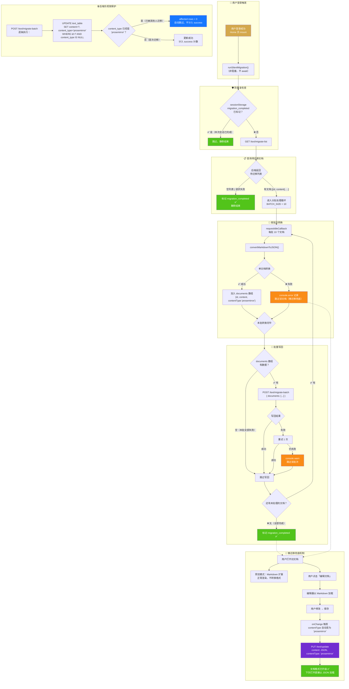
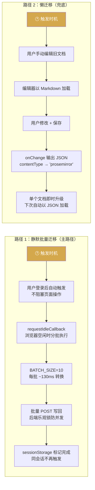

# 文档存储格式迁移流程

当前迁移采用 **"静默批量迁移（主路径）+ 懒迁移（兜底）"** 双层保障机制：

## 两条路径对比

## 关键时间节点

| 节点 | 行为 | 用户感知 |
|------|------|----------|
| 登录瞬间 | `runSilentMigration()` 启动 | **无感知** |
| 空闲时段 | 批次转换 + 写回 | **无感知** |
| 迁移中编辑同一文档 | 后端乐观锁跳过迁移 | **无感知**（懒迁移兜底） |
| 编辑任意旧文档 | 保存时自动升级为 JSON | **正常操作** |
| 新建文档 | 直接以 JSON 存储 | **正常操作** |
| 全部迁移完成 | `migration_completed` 标记 | **无感知** |
